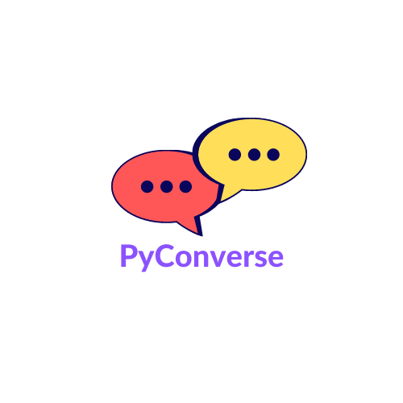

# PyConverse
-----------
[](https://pepy.tech/project/pyconverse)
[](https://GitHub.com/Naereen/StrapDown.js/graphs/commit-activity)
[](https://www.python.org/)
[](https://pypi.com/project/pip)
[](https://pypi.python.org/pypi/ansicolortags/)
[](https://github.com/Naereen/Strapdown.js/releases)

<p align="center">
  
</p>


## Let me try first

### Installation 

```
pip install pyconverse
```

### Usage

Please try this notebook that demos the core functionalities: [basic usage notebook](https://github.com/AnjanaRita/converse/blob/master/notebook/usage.ipynb)

## Introduction

Conversation analytics plays an increasingly important role in shaping great customer experiences across various industries like finance/contact centres etc...
primarily to gain a deeper understanding of the customers and to better serve their needs. This library, *PyConverse* is an attempt to provide tools & methods which can be used to gain an understanding of the conversations from multiple perspectives using various NLP techniques. 

## Why *PyConverse*?

I have been doing what can be called conversational text NLP with primarily contact centre data from various domains like Financial services, Banking, Insurance etc for the past year or so, and I have not come across any interesting open-source tools that can help in understanding conversational texts as such I decided to create this library that can provide various tools and methods to analyse calls and help answer important questions/compute important metrics that usually people want to find from conversations, in contact centre data analysis settings. 

## Where can I use *PyConverse*?

The primary use case is geared towards contact centre call analytics, but most of the tools that Converse provides can be used elsewhere as well. 

There’s a lot of insights hidden in every single call that happens, Converse enables you to extract those insights and compute various kinds of KPIs from the point of Operational Efficiency, Agent Effectiveness & monitoring Customer Experience etc. 

If you are looking to answer questions like these:- 

1. What was the overall sentiment of the conversation that was exhibited by the speakers? 
2. Was there periods of dead air(silence periods) between the agents and customer? if so how much? 
3. Was the agent empathetic towards the customer?
4. What was the average agent response time/average hold time?
5. What was being said on calls? 

and more... pyconverse might be of small help.

## What can *PyConverse* do?

At the moment pyconverse can do a few things that broadly fall into these categories:- 

1. Emotion identification 
2. Empathetic statement identification
3. Call Segmentation
4. Topic identification from call segments
5. Compute various types of Speaker attributes: 
    1. linguistic attributes like: word counts/number of words per utterance/negations etc.
    2. Identify periods of silence & interruptions. 
    3. Question identification
    4. Backchannel identification
6. Assess the overall nature of the speaker via linguistic attributes and tell if the Speaker is: 
    1. Talkative, verbally fluent
    2. Informal/Personal/social
    3. Goal-oriented or Forward/future-looking/focused on past
    4. Identify inhibitions
7. Transcript summarization (Abstractive summarization)

### What Next?

1. Improve documentation.
2. Add more use case notebooks/examples.
3. Improve some of the functionalities and make it more streamlined. 

### Built with: 

|Transformers|Spacy|Pytorch|
|---|---|---|
||||

### Credits: 

_Note: The backchannel Utterance classification method is inspired by facebook's [Unsupervised Topic Segmentation of Meetings with BERT Embeddings](https://arxiv.org/abs/2106.12978) paper (arXiv:2106.12978 [cs.LG])_

